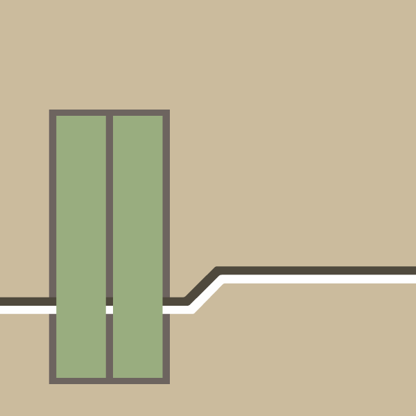

# 💬 Message from the developer!!

The current version **v2.1.1** of **Atom v2** will be the last version.  
The reason for this is that v2 is the realization of the initial concept of Atom, and there will be several disruptive updates coming in the future to improve convenience.

We will move to **Atom v3** development and implement more convenient APIs. :)

# Atom Project 

I don't want to process GTFS as it is 😟,  
Try using Atom at such times 🤗.

# Let's start up

```bash
$ npm i
$ npm run build
$ npm start
```

# Environment example

.env

```
DB_HOST=localhost
DB_PORT=3306
DB_USERNAME=root
DB_PASSWORD=root
DB_DATABASE=atom
DB_LOGGING=false
DB_SYNC=false

GTFS_TO_DB=false

REALTIME=true

PORT=3000
```

# Database

Use MySQL or MariaDB.

# Where are the references?

Try accessing `localhost:3000` after [Let's start up](#lets-start-up).  
There should be what you want.

# Q&A

## Is there an Atom public server?

> No :(  
> When **Atom v3** is released, the public server will be available.  
> Please wait patiently. :)

## Is the Docker image published?

> No :(  
> When **Atom v3** is released, a Docker image will also be published. :)
